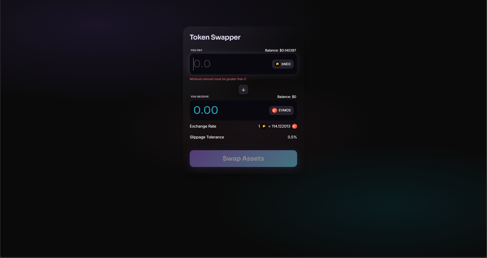

# Fancy Form

This project is a functional web application for swapping tokens, built with React, TypeScript, Tailwind CSS, and Shadcn UI. It demonstrates a complete flow from form submission with validation to mock API interaction.

## Screenshots



## Features

- **Token Swapping Interface**: A clean, responsive form for swapping tokens.
- **Form Management**: Built with `react-hook-form` for robust form handling.
- **Input Validation**: Schema-based validation using `zod` to ensure data integrity.
- **Dynamic States**: Handles loading, success, and error states for a seamless user experience.
- **Custom Hooks**: Features hooks for currency input formatting and currency calculations.
- **Mock API**: Simulates blockchain transaction delays and responses.

## Installation

1.  Clone the repository (if applicable).
2.  Navigate to the project directory.
3.  Install dependencies:

    ```bash
    npm install
    ```

## Usage

Start the development server:

```bash
npm run dev
```

The application will be accessible at `http://localhost:5173`.

## Technology Stack

- **Language**: [TypeScript](https://www.typescriptlang.org/)
- **Framework**: [React](https://react.dev/) + [Vite](https://vitejs.dev/)
- **State Management**: [Zustand](https://zustand.dev/)
- **Styling**: [Tailwind CSS](https://tailwindcss.com/)
- **UI Components**: [Shadcn UI](https://ui.shadcn.com/)
- **Icons**: [lucide-react](https://lucide.dev/)
